# Plataforma de ventas en línea
___

  

## Índice
___
- [Introducción](#introducción)
- [Objetivos del Proyecto](#objetivos-del-proyecto)
- [Implementación](#implementación)
- [Proceso UX](#proceso-UX)
     1) [Descubrimiento e Investigación](#Descubrimiento-e-investigación)
        - [Entrevista con el Cliente](#entrevista-con-el-cliente)
        - [Entrevista con el Usuario](#entrevista-con-el-Usuario)
        - [Benchmark](#benchmark)
     2) [Síntesis y Definición](#Síntesis-y-Definición)
        - [Affinity Map](#affinity-map)
        - [User Persona](#user-persona)
        - [Customer Journey Map](#customer-journey-map)
        - [Definición del Producto](#definicion-del-producto)
     3) [Ideación, Prototipado y User Testing](#ideación,-prototipado-y-user-testing)
        - [Card Sorting](#card-sorting)
        - [Prototipo de Baja Fidelidad](#prototipo-de-baja-fidelidad)
        - [Prototipo de Media Fidelidad](#prototipo-de-media-fidelidad)
        - [Prototipo de Alta Fidelidad](#prototipo-de-alta-fidelidad)
        - [User Testing](#user-testing)

- [Conclusiones](#conclusiones)
- [Enlaces](#enlaces)
    

## Introducción
---
__Dahlia Swimwear__ es un emprendimiento peruano que diseña trajes de baño. Esta iniciativa comenzó hace 6 años por María José Bullen una joven diseñadora de modas que tomó el sueño inspirada por su abuela, para continuar con este camino de crear diseños originales dirigidos a mujeres que le gustan estar a la moda; encontrándose diferentes retos en todo este tiempo dentro de los más importantes ha sido enfrentarse a empresas que cuentan con páginas Web ya establecidas. Actualmente, solo vende por las redes sociales facebook, instagram, cuando realiza Showroom cada dos meses, así como en la tienda física multimarca "Fascino La Galería" ubicadas en San Isidro y Jockey Plaza.
Por ello, fuimos en búsqueda de entender y analizar el contexto del negocio de ventas de traje de baño, buscando referencias en el mercado, entender las necesidades de los usuarios para obtener el mejor flujo de compra a través de una tienda online. 

## Objetivos del Proyecto
---

 + Identificar las fortalezas y debilidades de nuestra cliente de "Dahlia Swimwear".
 + Aplicar herramientas de investigación dentro del proceso Design Thinking a fin de entender el contexto del problema de nuestro proyecto.           
 + Conocer a los posibles usuarios que compran traje de baño y entender sus necesidades y requerimientos al momento de usar un portal de ventas online.
 + Diseñar una plataforma web a fin de crear una experiencia agradable a los usuarios al momento de comprar un traje de baño en la tienda online.
 + Encontrar una solución para mejorar las ventas online de Dahlia Swimwear.

## Implementación
---
 Para realizar este proyecto hemos seleccionado las siguientes actividades para poder crear nuestra propuesta de valor:

|Actividad|Descripción|Puntos|
|:----|:---|:---:|
|Entrevistas con cliente|Realización de entrevistas con el cliente (dueño del reto) y establecimiento de sus metas y objetivos.|25|
|Benchmark| Revisión de features de la competencia y referencias análogas. | 20 |
|Entrevistas con usuarios| Entrevistas en profundidad con al menos 5 usuarios. | 60 | 
|Card Sorting| Actividad para entender el modelo mental de los usuarios en términos de organización de los contenidos. | 15 |
|Testeos de prototipos| Sesiones de testing de la solución propuesta (baja, media y alta fidelidad) con al menos 5 usuarios por sesión. | 60 |
|Sketching y wireframing| Elaboración de prototipos de baja y mediana fidelidad. | 30 |
|Prototipado de alta fidelidad| Elaboración de prototipo en base a las pantallas diseñadas. | 80 |
|| Total | 290  |

## Proceso UX
---
Todas las actividades y productos generados en esta investigación estuvo enmarcado en el Diseño centrado en el usuario y se pueden dividir en las siguientes etapas del proceso Design Thinking

  

### 1) Descubrimiento e Investigación
En esta fase aplicamos las siguientes herramientas que nos ayudaron a entender al usuario, el mercado, al cliente, a la empresa, benchmarking.

#### Entrevista con el Cliente

 "Le doy importancia a cómo se sienten mis clientes." Maria José Bullen 

Se entrevistó a María José Bullén una joven emprendedora de trajes de baño, que busca destacar con sus diseños exclusivos y de buena calidad, pero que reconoce que digitalmente se encuentra con deficiencia. A través de la entrevista pudimos identificar las fortalezas y debilidades de su emprendimiento y se pudo obtener el User Target para sus productos, para continuar con el siguiente paso.

__USER TARGET : Mujeres de edad promedio entre 18 y 45 años que disfrutan del verano, el sol, la piscina; Amantes de la moda y sus últimas tendencias. Estas mujeres deben tener actitud, poder adquisitivo y ser independientes.__

  

#### Entrevista con el Usuario

Se entrevistó a ____2 usuarias (clientes)__ y __6 posibles____ usuarias para poder conocer sus opiniones y reconocer lo positivo y negativo que tengan en el flujo de compra en trajes de baño, así como su experiencia sobre el uso de plataformas digitales

Dentro de ello, se reconoció los fragmentos más tocados:
+ Valoro más la calidad y diseño de la tela que los precios al momento de comprar un traje de baño
+ Busco sentirme cómoda al momento de escoger un diseño.
+ Compro en tienda física más que virtualmente.

   

   

#### Benchmark
Aplicamos esta técnica para observar y comparar otros productos y/o servicios, con el objetivo de detectar las mejores prácticas a aplicar en nuestro proyecto. Analizamos los principales competidores de Dahlia en el Perú. Cómo proceso crítico escogimos la comercialización, evaluando específicamente plataforma de ventas online y atención al cliente.

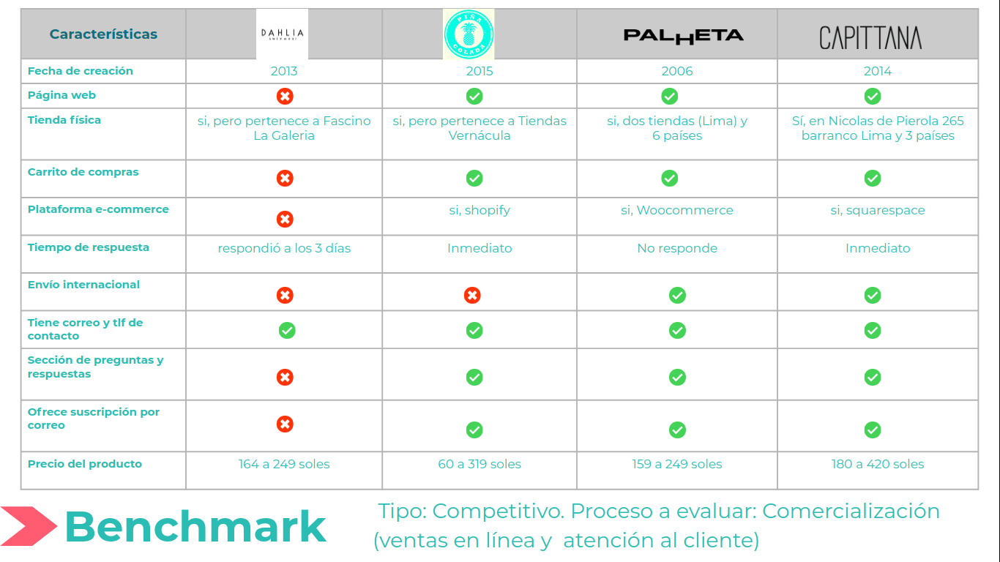

### 2) Síntesis y Definición
En esta etapa logramos encontrar el sentido de lo investigado y lo obtenido en la etapa de investigación UX

#### Affinity Map
Después de las entrevistas realizadas a los usuarios y posibles usuarios, se hizo un mapa de afinidad para agrupar por temas los hallazgos y observaciones mas resaltantes de nuestras usuarias durante la realización de las entrevistas.

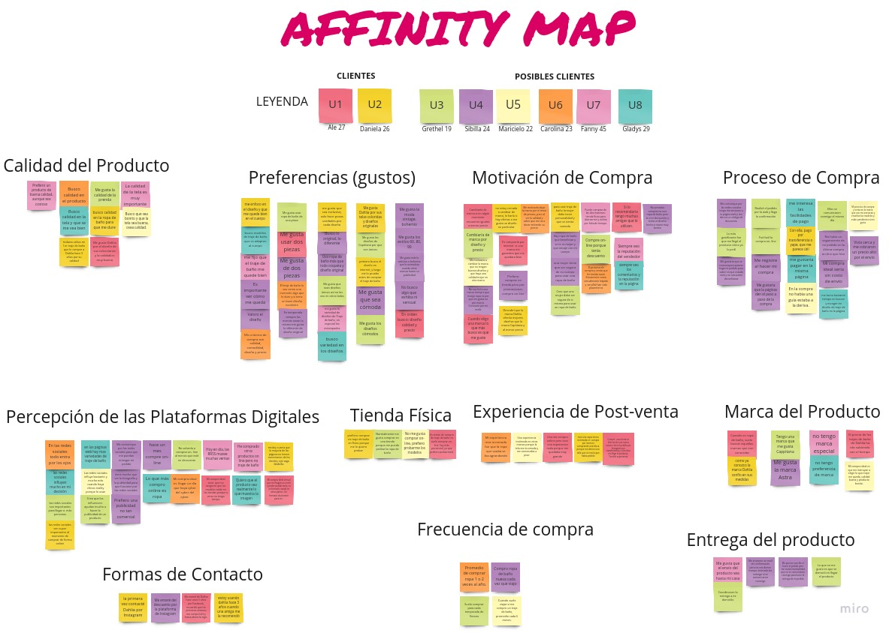

 Luego, realizamos una priorización de los temas y obtuvimos lo siguiente:
+ Preferencias(Gustos): 
   + Variedad en diseños.
   + Diseños exclusivos.
   + Comodidad (se adapte al cuerpo).
+ Motivación de Compra:
   + Calidad del producto.
   + Descuentos en compras on-line.
   + Reputación del vendedor.
+ Procesos de Compra:
   + Facilidades de pago.
   + Comunicación con el cliente.
   + Seguimiento de la compra.
+ Percepción de Plataformas Digitales:
   + Ventas en redes sociales.
   + Decisión de compra.
   + Uso de la publicidad.

#### User Persona
Luego de obtener los grupos con las caracteristicas más resaltantes en el Affinity Map y los hallazgos de las entrevistas, diseñamos nuestra __USER PERSONA__ , que es un personaje de ejemplo que representa al grupo de usuarios de nuestro producto

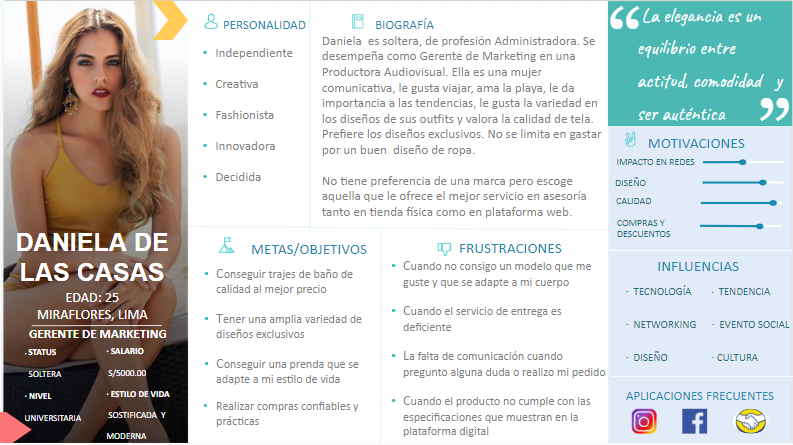

#### Customer Journey Map
Esta herramienta de Design Thinking nos permitió evaluar el caso en que nuestra USER PERSONA realiza una compra online en Dahlia SW, analizando sus emociones, sentimientos o sus impresiones cuando atraviesa por cada una de las etapas (Touchpoint) del proceso de compra de un traje de baño. Aqui se puede destacar. los gain points (experiencia positiva) y los pain points (experiencia negativa), así cómo los puntos más críticos durante el proceso de compra.

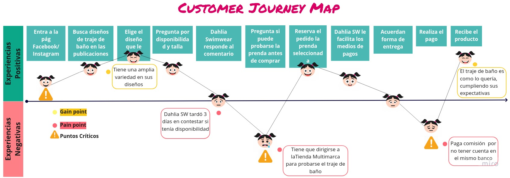

#### Definición del Producto

##### Problem Statements
Una vez desarrollado todo lo anterior se definieron los __Problem Statements__ y se priorizaron los siguientes:

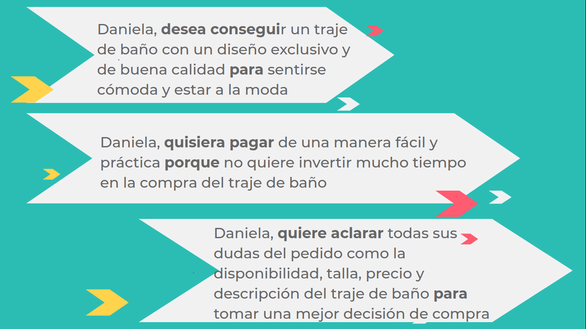

##### How Might We, What if
Se realizó pequeñas preguntas __¿Cómo podriamos?__ _(How Might We)_ que nos ayudaron a pensar en posibles soluciones para nuestros __problem statement__ y nos van a ayudar a entenderlos mejor.

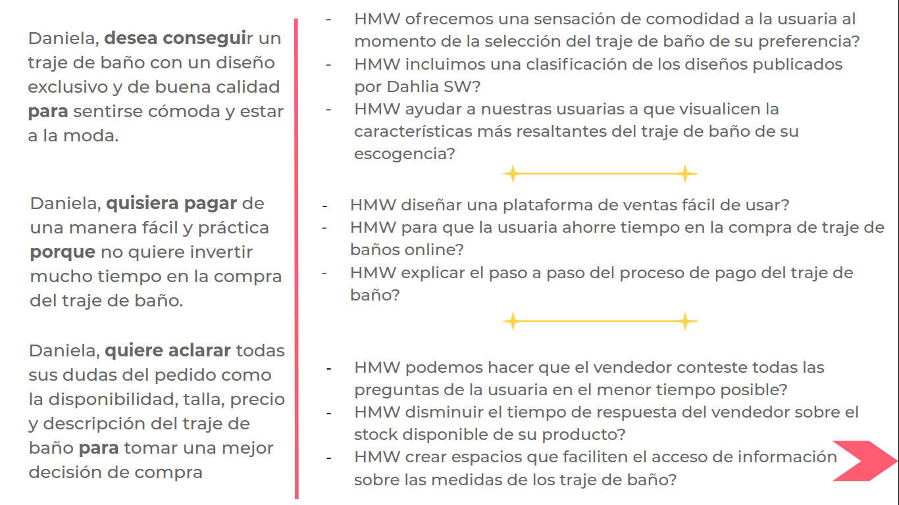

Luego, elaboramos los __What if__ para cuestionarnos los problemas y que surgan ideas de solución a nuestro problema

+ Problem Statement 1
   - _What if_ ofrecemos un catálogo por temporada que le permita al usuario facilitar la búsqueda del traje de baño?
   - _What if_ si clasificamos los trajes de baño por tipo: bikini, trikini, enterizo?
   - _What if_ al seleccionar un Traje de Baño de su elección, aparezca una descripción más detallada, precio y tallas disponibles?

+ Problem Statement 2
   - _What if_ realizamos un e-commerce que cuente con una metodología fácil de entender?
   - _What if_ si le proporcionamos todos los detalles de envío y pago al usuario al momento de la compra?
   - _What if_ si utilizamos formularios con una estructura sencilla, que le permita al usuario entender que esta avanzando satisfactoriamente

+ Problem Statement 3
   - _What if_ creamos un chat en línea para que el usuario contacte al vendedor
   - _What if_ colocamos las redes sociales y los números de contacto de la empresa en un sitio visible
   - _What if_ diseñamos una tabla de medidas para que el usuario obtenga sus medidas cuando se encuentre buscando el traje de baño?

##### Lista de Features
Se definieron y priorizaron una lista de funcionalidades con ayuda del Benchmark y la lluvia de ideas _(brainstorm)_ para la definición del problema y sus posibles soluciones, y formarán parte de nuestro MVP o Producto Mínimo Viable.
1. Creación de un **catálogo en línea de traje de baño** con las colecciones por temporada de Dahlia Swimwear
2. **Filtros de búsqueda** de traje de baño en la tienda online por tipo de Traje de baño
3. **Tienda online** donde el usuario encuentre la descripción detallada de los trajes de baño, mostrando talla, precio, disponibilidad, antes de tomar una decisión
4. Creación de una **plataforma e-commerce** para Dahlia Swimwear
5. Proceso de compra con **formularios sencillos e intuitivos** aplicando una metodología paso a paso
6. Implementación de un **chat en línea** que le permita al usuario escribirle al vendedor
7. Elaboración de una **tabla de medidas** para que el usuario busque su talla de traje de baño de una manera facil y genuina

### 3) Ideación, Prototipado y User Testing

#### Card Sorting
Esta técnica nos permitió categorizar el contenido de nuestro sitio Web a través del entendimiento del modelo mental de los usuarios. Cómo resultado obtuvimos la siguientes agrupaciones o tendencias representados en un cluster o dendograma. Esto nos permitió definir nuestra arquitectura de información y estructurar el flujo de navegación del usuario

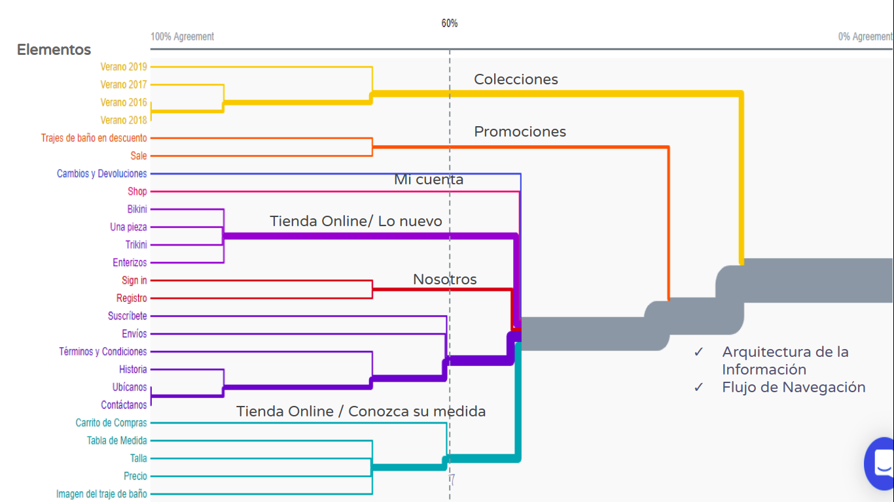

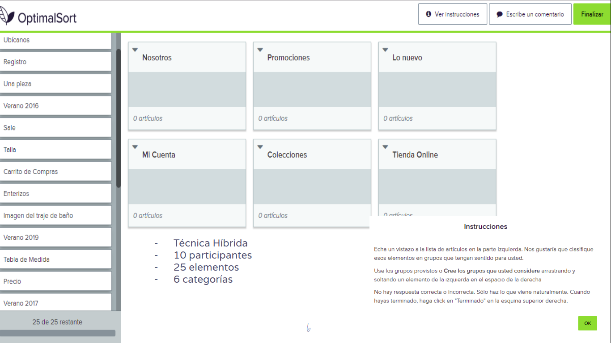

#### Prototipo de Baja Fidelidad
En esta primera parte de la fase de prototipado, elaboramos nuestro prototipo de papel o baja fidelidad, que representan nuestras pantallas de interfaz y permiten a los usuarios interactuar con él y visualizar rápidamente las ideas de diseño de una manera eficiente y de bajo costo. Aqui pueden observar los sketch o bocetos de nuestro proyecto.

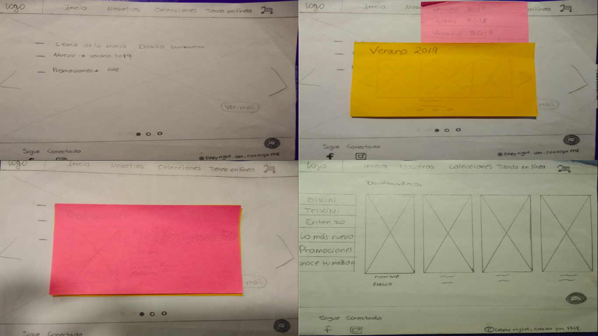
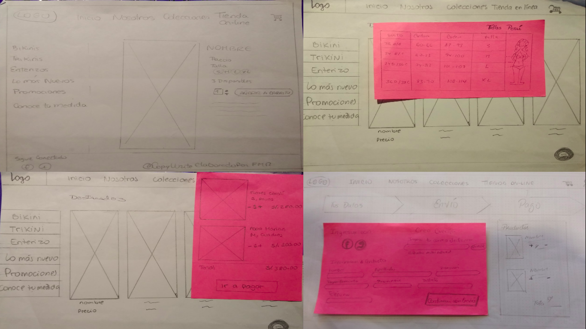
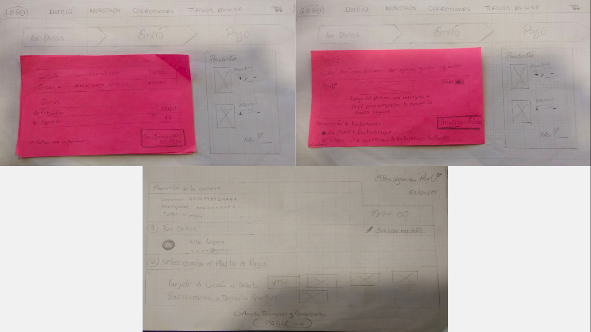

+ Resultados
   - Ejecución de tareas promedio 18 seg
   - 80% de los usuarios cometieron algún error
   - Mayor dificultad: ubicar tienda en línea y tabla de medidas
   - Menor Facilidad: navegar el flujo de compra
   - Oportunidad de mejora: agregar función volver en tabla de medidas, resaltar acceso a tienda en línea, mejorar la ubicación de acceso a la tabla de medida

#### Prototipo de Media Fidelidad 
Es elaborado luego de mejorar nuestro prototipo de baja calidad en la 1era iteracción. Aqui se destaca como será la estructura o el esqueleto de nuestro siio web, sin tomar en cuenta el diseño visual. A continuación puede observar nuestro prototipo con las mejoras realizadas del primer testeo

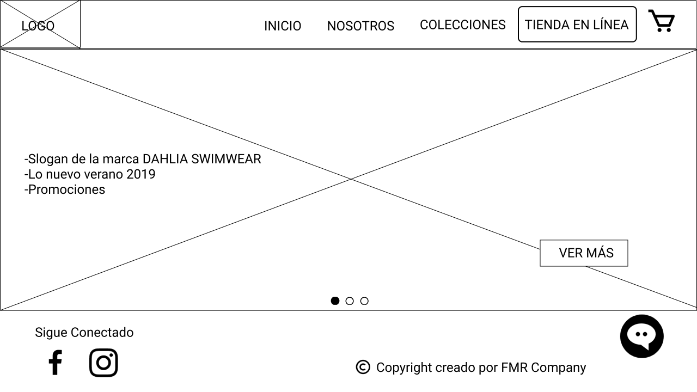
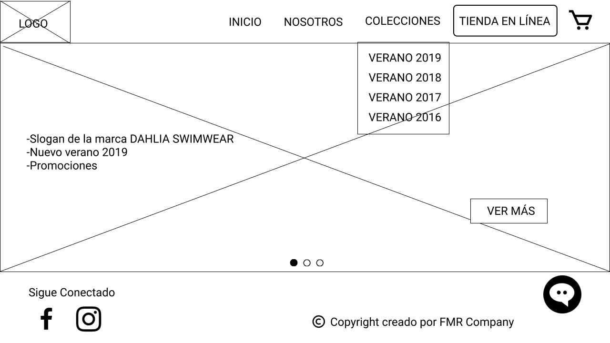
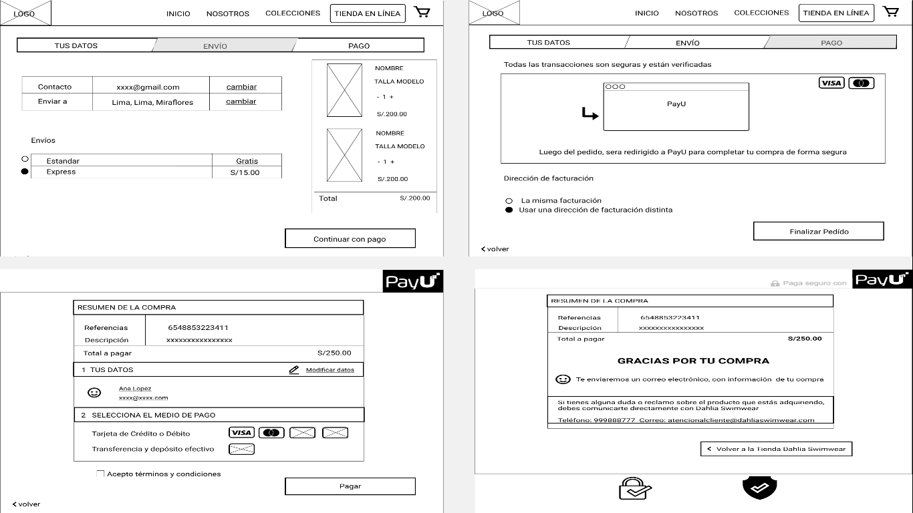

+ Resultados
   - Ejecución de tareas promedio 14 seg
   - 60% de los usuarios cometieron algún error
   - Mayor Dificultad: ubicar la tabla de medidas, confusión con los iconos de visa/máster en la sección de información de PayU
   - Mayor Facilidad: siguen el proceso de compra de forma intuitiva
   - Oportunidad de mejora: agregar función cerrar ventana en colecciones y quitar iconos de visa/máster en información

#### Prototipo de Alta Fidelidad
Nuestro prototipo de alta fidelidad muestra las interacciones que serán parte del producto final y corresponde a las funcionalidades que solucionan los 3 problem statements que hemos priorizado. Es ideal para que los usuarios interactuen, y sirvan como guía para una posterior implementación y etapa de producción
Este prototipo contiene botones e hipervínculos en los que se puede hacer clic y muchos componentes del prototipo actúan como lo harían en la aplicación real.

Pantallas de inicio, Promociones, Colecciones, Tienda en línea

Pantallas de proceso de compra

+ Resultados
  - Ejecución de tareas promedio  5 seg.
  - 40% de los usuarios cometieron algún error
   - Mayor Dificultad: Ubicar las promociones
   - Mayor Facilidad: Navegar el flujo de compra, encontrar la talla de medidas
   - Oportunidad de mejora: Disminuir scroll de pantalla para mejorar las organización de algunos elementos (acciones)
   

#### User Testing
La metodología que utilizamos para llevar a cabo los User testing a nuestros prototipos fue la siguiente:
- 3 escenarios:
   - El usuario debe explorar la página y acceder a las colecciones de traje de baño
   - El usuario debe ingresar a la tienda online para ver información más detallada del producto
   - El Usuario debe ingresar a la plataforma de pago
- 10 tareas
- 3 sesiones (iteraciones)
- Duración de 5-10 minutos
- 15 usuarios (5 usuarios por cada prototipo)
- Técnica de pensar en voz alta y preguntas de seguimiento al finalizar
- Análisis de métricas cuantitativas y cualitativas
   - 100% de los usuarios ejecutaron sus tareas
   - Tiempo promedio de ejecución de tareas 15 segundos
   - 1 Error cometido (promedio)
   - Patrones de comportamiento
   - Oportunidades de mejora 

Por eso es la importancia de los User testing porque nos ayudan a saber lo que realmente hacen los usuarios al interactuar con nuestro producto y no lo que uno piensa que los usuarios van a hacer

## Conclusiones
 + Nuestra propuesta de valor, viene de un proceso iterativo, es decir, de ideas que se desarrollan, prueban y mejoran varias veces. __(Ciclo de mejora continua)__

   + El flujo de navegación del proceso de compra en la plataforma e-commerce, es intuitivo y fue confirmado por la mayoría de nuestros usuarios

   + Logramos brindar al usuario una forma sencilla de poder encontrar información detallada del producto (ejm: la tablas de medidas)

   + Es necesario, una 4ta iteración para mejorar el Prototipo de Alta fidelidad

   + Elaborar prototipos es una forma de validar o invalidar nuestras posibles soluciones o suposiciones; simulando la experiencia que queremos ofrecer al usuario sin requerir construir el real

## Enlaces

+ [Carpeta Drive con el sustento de la investigación](https://drive.google.com/drive/folders/1JRWWwm6HuJqhHuGsYCvezk2bqhJuXaNS)

+ [Prototipo de Media Fidelidad en Figma](https://www.figma.com/file/zfenrYcUnNSuKsWE2uYbGg/MarketPlace-Dahlia-Swimwear?node-id=1247%3A254)

+ [Prototipo de Alta Fidelidad en Figma](https://www.figma.com/file/PC1mPNmf0Wzjn1BMbUNIZK/AltaFidelidad-Dahlia-Definitvo?node-id=169%3A63) 

+ [Prototipo interactivo en Invision](https://invis.io/6GTPLTVJVDR#/381693751_Desktop_Uno)

+ [Prototipo en Zeplin](https://zpl.io/ankBB0A)

+ [Video de presentación final del proyecto en Loom](https://www.loom.com/share/5059057e7e7f48f68c362841a4715da8)
