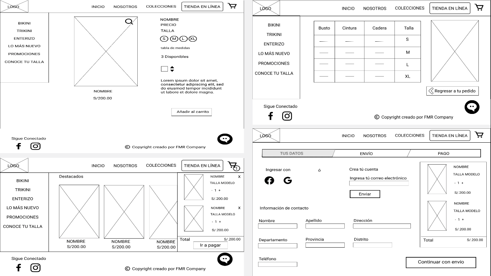
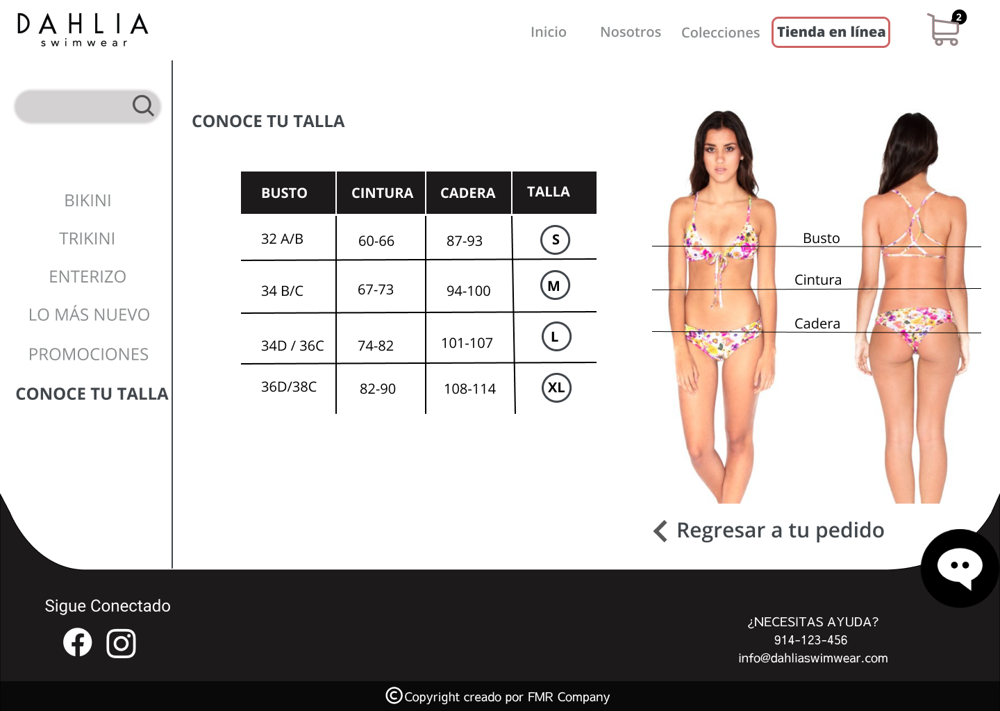

# Plataforma de ventas en línea

## Índice

- [Introducción](#introducción)
- [Objetivo del Proyecto](#objetivo-del-proyecto)
- [Implementación](#implementación)
- [Proceso UX](#proceso-UX)
     1) [Descubrimiento e Investigación](#Descubrimiento-e-investigación)
        - [Entrevista con el Cliente](#entrevista-con-el-cliente)
        - [Entrevista con el Usuario](#entrevista-con-el-Usuario)
        - [Benchmark](#benchmark)
     2) [Síntesis y Definición](#Síntesis-y-Definición)
        - [Affinity Map](#affinity-map)
        - [User Persona](#user-persona)
        - [Customer Journey Map](#customer-journey-map)
        - [Problem Statements](#problem-statements)
        - [How might We, What if](#how-might-we,-what-if)
         - [Definición del Producto](#definición-del-producto)
        - [Planteamiento de la solución](#planteamiento-de-la-solucion)
     3) [Ideación, Prototipado y User Testing](#ideación,-prototipado-y-user-testing)
        - [Card Sorting](#card-sorting)
        - [Prototipo de Baja Fidelidad](#prototipo-de-baja-fidelidad)
        - [Prototipo de Media Fidelidad](#prototipo-de-media-fidelidad)
        - [Prototipo de Alta Fidelidad](#prototipo-de-alta-fidelidad)

- [Enlaces](#enlaces)
    

## Introducción
---
Dahlia Swimwear es un emprendimiento peruano que diseña trajes de baño. Esta iniciativa comenzó hace 6 años por María José Bullen una joven diseñadora de modas que tomó el sueño inspirada por su abuela para continuar con este camino de crear diseños originales dirigidos a mujeres que le gustan estar a la moda; encontrándose diferentes retos en todo este tiempo dentro de los más importantes ha sido enfrentarse a empresas que cuentan con páginas Web ya establecidas, mientras que por su lado solo vende por redes sociales: facebook, instagram, así como en una tienda física multimarca "Fascino La Galería" ubicadas en San Isidro y Jockey Plaza.
Por ello, fuimos en búsqueda de entender y analizar el contexto del negocio, buscando referencias en el mercado, entender las necesidades de los usuarios para obtener el mejor flujo de compra a través de una tienda online. 

## Objetivo del Proyecto
---

## Implementación
---
 Para realizar este proyecto hemos escogido y utilizado las siguientes actividades:

|Actividad|Descripción|Puntos|
|:----|:---|:---:|
|Entrevistas con cliente|Realización de entrevistas con el cliente (dueño del reto) y establecimiento de sus metas y objetivos.|25|
|Benchmark| Revisión de features de la competencia y referencias análogas. | 20 |
|Entrevistas con usuarios| Entrevistas en profundidad con al menos 5 usuarios. | 60 | 
|Card Sorting| Actividad para entender el modelo mental de los usuarios en términos de organización de los contenidos. | 15 |
|Testeos de prototipos| Sesiones de testing de la solución propuesta (baja, media y alta fidelidad) con al menos 5 usuarios por sesión. | 60 |
|Sketching y wireframing| Elaboración de prototipos de baja y mediana fidelidad. | 30 |
|Prototipado de alta fidelidad| Elaboración de prototipo en base a las pantallas diseñadas. | 80 |
|| Total | 290  |

## Proceso UX
---

### 1) Descubrimiento e Investigación

#### Entrevista con el Cliente

#### Entrevista con el Usuario

#### Benchmark

### 2) Síntesis y Definición
#### Affinity Map

#### User Persona

#### Customer Journey Map

#### Problem Statements
Son los siguientes:

#### How Might We

#### Definición del Producto
#### Planteamiento de la solucion

### 3) Ideación, Prototipado y User Testing

#### Card Sorting

#### Prototipo de Baja Fidelidad

+ Resultados

#### Prototipo de Media Fidelidad
+ Resultados

#### Prototipo de Alta Fidelidad
+ Resultados

## Enlaces
---