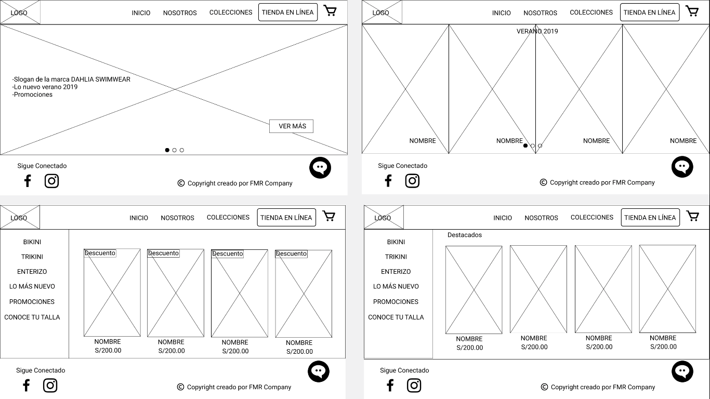

# Plataforma de ventas en línea

  

## Índice

- [Introducción](#introducción)
- [Objetivos del Proyecto](#objetivos-del-proyecto)
- [Implementación](#implementación)
- [Proceso UX](#proceso-UX)
     1) [Descubrimiento e Investigación](#Descubrimiento-e-investigación)
        - [Entrevista con el Cliente](#entrevista-con-el-cliente)
        - [Entrevista con el Usuario](#entrevista-con-el-Usuario)
        - [Benchmark](#benchmark)
     2) [Síntesis y Definición](#Síntesis-y-Definición)
        - [Affinity Map](#affinity-map)
        - [User Persona](#user-persona)
        - [Customer Journey Map](#customer-journey-map)
        - [Problem Statements](#problem-statements)
        - [How might We, What if](#how-might-we,-what-if)
     3) [Ideación, Prototipado y User Testing](#ideación,-prototipado-y-user-testing)
        - [Card Sorting](#card-sorting)
        - [Prototipo de Baja Fidelidad](#prototipo-de-baja-fidelidad)
        - [Prototipo de Media Fidelidad](#prototipo-de-media-fidelidad)
        - [Prototipo de Alta Fidelidad](#prototipo-de-alta-fidelidad)
        - [User Testing](#user-testing)

- [Conclusiones](#conclusiones)
- [Enlaces](#enlaces)
    

## Introducción
---
Dahlia Swimwear es un emprendimiento peruano que diseña trajes de baño. Esta iniciativa comenzó hace 6 años por María José Bullen una joven diseñadora de modas que tomó el sueño inspirada por su abuela para continuar con este camino de crear diseños originales dirigidos a mujeres que le gustan estar a la moda; encontrándose diferentes retos en todo este tiempo dentro de los más importantes ha sido enfrentarse a empresas que cuentan con páginas Web ya establecidas, mientras que por su lado solo vende por redes sociales: facebook, instagram, así como en una tienda física multimarca "Fascino La Galería" ubicadas en San Isidro y Jockey Plaza.
Por ello, fuimos en búsqueda de entender y analizar el contexto del negocio, buscando referencias en el mercado, entender las necesidades de los usuarios para obtener el mejor flujo de compra a través de una tienda online. 

## Objetivos del Proyecto
---

 + Identificar las fortalezas y debilidades de nuestra cliente de "Dahlia Swimwear".
 + Aplicar herramientas de investigación dentro del proceso Design Thinking a fin de entender el contexto del problema de nuestro proyecto.           
 + Conocer a los posibles usuarios que compran traje de baño y entender sus necesidades y requerimientos al momento de usar un portal de ventas online.
 + Diseñar una plataforma web a fin de crear una experiencia agradable a los usuarios al momento de comprar un traje de baño en la tienda online.
 + Encontrar una solución para mejorar las ventas online de Dahlia Swimwear.

## Implementación
---
 Para realizar este proyecto hemos seleccionado las siguientes actividades para poder crear nuestra propuesta de valor:

|Actividad|Descripción|Puntos|
|:----|:---|:---:|
|Entrevistas con cliente|Realización de entrevistas con el cliente (dueño del reto) y establecimiento de sus metas y objetivos.|25|
|Benchmark| Revisión de features de la competencia y referencias análogas. | 20 |
|Entrevistas con usuarios| Entrevistas en profundidad con al menos 5 usuarios. | 60 | 
|Card Sorting| Actividad para entender el modelo mental de los usuarios en términos de organización de los contenidos. | 15 |
|Testeos de prototipos| Sesiones de testing de la solución propuesta (baja, media y alta fidelidad) con al menos 5 usuarios por sesión. | 60 |
|Sketching y wireframing| Elaboración de prototipos de baja y mediana fidelidad. | 30 |
|Prototipado de alta fidelidad| Elaboración de prototipo en base a las pantallas diseñadas. | 80 |
|| Total | 290  |

## Proceso UX
---

  

### 1) Descubrimiento e Investigación
En esta fase aplicamos las siguientes herramientas que nos ayudaron a entender al usuario, el mercado, al cliente, a la empresa, benchmarking.

#### Entrevista con el Cliente

"Le doy importancia a cómo se sienten mis clientes." Cliente

Sé entrevistó a María José Bullén una joven emprendedora de trajes de baño, que busca destacar con sus diseños exclusivos y de buena calidad, pero que reconoce que digitalmente se encuentra con deficiencia. A través de la entrevista se pudo obtener el User Target, para continuar con el siguiente paso.

__USER TARGET : Mujeres de edad promedio entre 18 y 45 años que disfrutan del verano, el sol, la piscina; Amantes de la moda y sus últimas tendencias. Estas mujeres deben tener actitud, poder adquisitivo y ser independientes.__

  

#### Entrevista con el Usuario

Se entrevistó a ____2 usuarias__ y __6 posibles____ usuarias para poder conocer sus opiniones y reconocer lo positivo y negativo que tengan en el flujo de compra en trajes de baño.

Dentro de ello, se reconoció los fragmentos más tocados:
+ Valoro más la calidad y diseño de la tela que los precios al momento de comprar un traje de baño
+ Busco sentirme cómoda al momento de escoger un diseño.
+ Compro en tienda física más que virtualmente.

   

   

#### Benchmark
Aplicamos esta técnica para observar y comparar otros productos y/o servicios, con el objetivo de detectar las mejores prácticas a aplicar en nuestro proyecto. Analizamos los principales competidores de Dahlia en el Perú. Cómo proceso crítico escogimos la comercialización, evaluando específicamente plataforma de ventas online y atención al cliente.

### 2) Síntesis y Definición
En esta etapa logramos encontrar el sentido de lo investigado y lo obtenido en la etapa de investigación UX

#### Affinity Map
Después de las entrevistas realizadas a los usuarios y posibles usuarios, se hizo el affinity para tener puntos claros.

 De los cuales fueron estos los más resaltantes:
+ Preferencias(Gustos): 
   + Variedad en diseños.
   + Diseños exclusivos.
   + Comodidad (se adapte al cuerpo).
+ Motivación de Compra:
   + Calidad del producto.
   + Descuentos en compras on-line.
   + Reputación del vendedor.
+ Procesos de Compra:
   + Facilidades de pago.
   + Comunicación con el cliente.
   + Seguimiento de la compra.
+ Percepción de Plataformas Digitales:
   + Ventas en redes sociales.
   + Decisión de compra.
   + Uso de la publicidad.

#### User Persona
Luego de obtener los grupos con las caracteristicas más resaltantes en el Affinity Map y los hallazgos más resaltantes de las entrevistas, diseñamos nuestra __USER PERSONA__ , que es un personaje de ejemplo que representa al grupo de usuarios de nuestro producto

#### Customer Journey Map
Esta herramienta de Design Thinking nos permitió evaluar el caso en que nuestra USER PERSONA realiza una compra online en Dahlia SW, analizando sus emociones, sentimientos o sus impresiones cuando atraviesa por cada una de las etapas (Touchpoint) del proceso de compra de un traje de baño. Aqui se puede destacar. los gain points (experiencia positiva) y los pain points (experiencia negativa), así cómo los puntos más críticos durante el proceso de compra.

#### Problem Statements
Ya desarrollando todo lo anterior se pasó a plantearse lo siguiente:

#### How Might We
Se realizó pequeñas preguntas que nos ayudaron a pensar en posibles soluciones para nuestros __problem statement__ y nos van a ayudar a entenderlos mejor.

### 3) Ideación, Prototipado y User Testing

#### Card Sorting
Esta técnica nos permitió categorizar el contenido de nuestro sitio Web a través del entendimiento del modelo mental de los usuarios. Cómo resultado obtuvimos la siguientes agrupaciones o tendencias representados en un cluster o dendograma. Esto nos permitió definir nuestra arquitectura de información y estructurar el flujo de navegación del usuario

#### Prototipo de Baja Fidelidad
En esta primera parte de la fase de prototipado, elaboramos nuestro prototipo de papel o baja fidelidad, que representan nuestras pantallas de interfaz y permiten a los usuarios interactuar con él y visualizar rápidamente las ideas de diseño de una manera eficiente y de bajo costo. Aqui pueden observar los sketch o bocetos de nuestro proyecto.

+ Resultados
   - Ejecución de tareas promedio 18 seg
   - 80% de los usuarios cometieron algún error
   - Mayor dificultad: ubicar tienda en línea y tabla de medidas
   - Menor Facilidad: navegar el flujo de compra
   - Oportunidad de mejora: agregar función volver en tabla de medidas, resaltar acceso a tienda en línea, mejorar la ubicación de acceso a la tabla de medida

#### Prototipo de Media Fidelidad 
Es elaborado luego de mejorar nuestro prototipo de baja calidad en la 1era iteracción. Aqui se destaca como será la estructura o el esqueleto de nuestro siio web, sin tomar en cuenta el diseño visual. A continuación puede observar nuestro prototipo con las mejoras realizadas del primer testeo

+ Resultados
   - Ejecución de tareas promedio 14 seg
   - 60% de los usuarios cometieron algún error
   - Mayor Dificultad: ubicar la tabla de medidas, confusión con los iconos de visa/máster en la sección de información de PayU
   - Mayor Facilidad: siguen el proceso de compra de forma intuitiva
   - Oportunidad de mejora: agregar función cerrar ventana en colecciones y quitar iconos de visa/máster en información

#### Prototipo de Alta Fidelidad
Nuestro prototipo de alta fidelidad muestra las interacciones que serán parte del producto final y corresponde a las funcionalidades que solucionan los 3 problem statements que hemos priorizado. Es ideal para que los usuarios interactuen, y sirvan como guía para una posterior implementación y etapa de producción
Este prototipo contiene botones e hipervínculos en los que se puede hacer clic y muchos componentes del prototipo actúan como lo harían en la aplicación real.

+ Resultados
  - Ejecución de tareas promedio  5 seg.
  - 40% de los usuarios cometieron algún error
   - Mayor Dificultad: Ubicar las promociones
   - Mayor Facilidad: Navegar el flujo de compra, encontrar la talla de medidas
   - Oportunidad de mejora: Disminuir scroll de pantalla para mejorar las organización de algunos elementos (acciones)

#### User Testing
La metodología que utilizamos para llevar a cabo los User testing a nuestros prototipos fue la siguiente:
- 3 escenarios:
   - El usuario debe explorar la página y acceder a las colecciones de traje de baño
   - El usuario debe ingresar a la tienda online para ver información más detallada del producto
   - El Usuario debe ingresar a la plataforma de pago
- 10 tareas
- 3 sesiones (iteraciones)
- Duración de 5-10 minutos
- 15 usuarios (5 usuarios por cada prototipo)
- Técnica de pensar en voz alta y preguntas de seguimiento al finalizar
- Análisis de métricas cuantitativas y cualitativas
   - 100% de los usuarios ejecutaron sus tareas
   - Tiempo promedio de ejecución de tareas 15 segundos
   - 1 Error cometido (promedio)
   - Patrones de comportamiento
   - Oportunidades de mejora 

Por eso es la importancia de los User testing porque nos ayudan a saber lo que realmente hacen los usuarios al interactuar con nuestro producto y no lo que uno piensa que los usuarios van a hacer

## Conclusiones
 + Nuestra propuesta de valor, viene de un proceso iterativo, es decir, de ideas que se desarrollan, prueban y mejoran varias veces. __(Ciclo de mejora continua)__

   + El flujo de navegación del proceso de compra en la plataforma e-commerce, es intuitivo y fue confirmado por la mayoría de nuestros usuarios

   + Logramos brindar al usuario una forma sencilla de poder encontrar información detallada del producto (ejm: la tablas de medidas)

   + Es necesario, una 4ta iteración para mejorar el Prototipo de Alta fidelidad

   + Elaborar prototipos es una forma de validar o invalidar nuestras posibles soluciones o suposiciones; simulando la experiencia que queremos ofrecer al usuario sin requerir construir el real

## Enlaces

+ Link del Drive carpeta de los documentos complementarios https://drive.google.com/drive/folders/1JRWWwm6HuJqhHuGsYCvezk2bqhJuXaNS

+ Link del Prototipo en Figma 

+ Link del Prototipo interactivo Invision
+ Link del Prototipo en Zeplin
+ Link del Video en Loom https://www.loom.com/share/5059057e7e7f48f68c362841a4715da8
